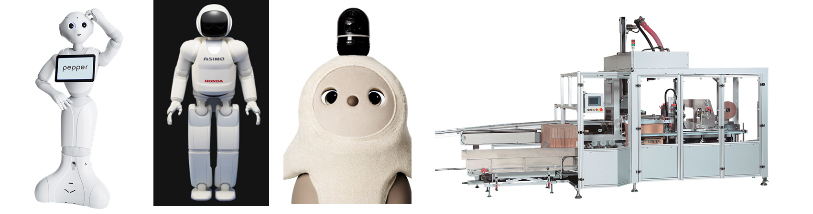
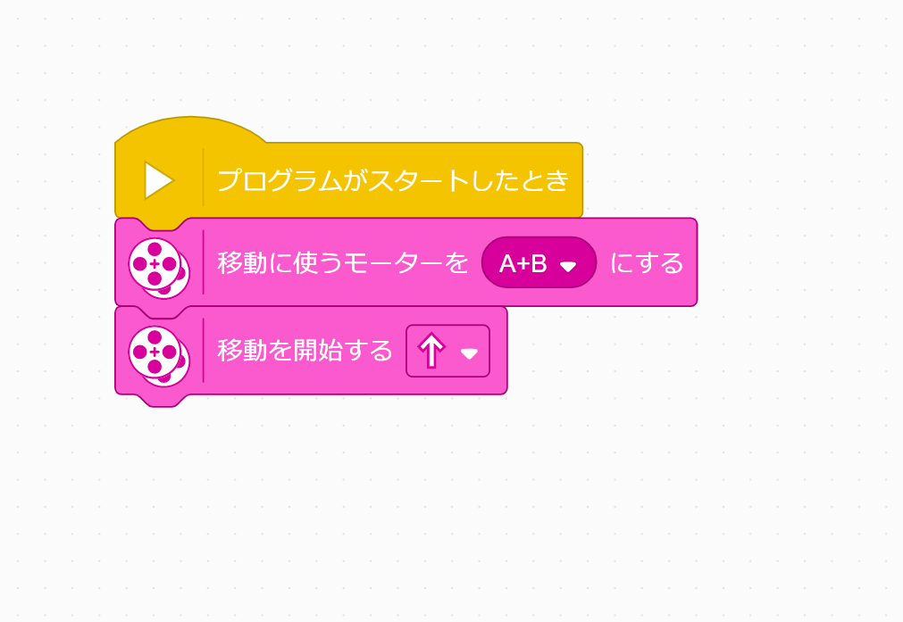
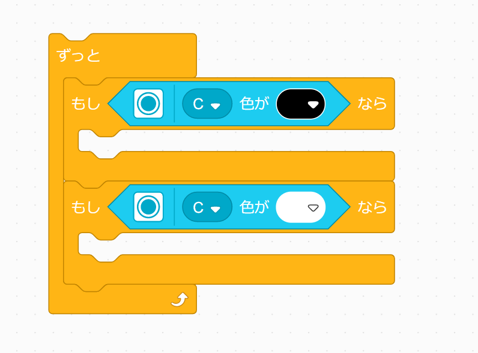

# AIC中学生向け講座「LEGO SPIKEでロボット制御入門」テキスト

## 0. はじめに
### ロボットって，なに？

ロボットと聞いて，皆さんは何を思い浮かべますか？ PepperやASIMOのような人形ロボット，またはパロやLOVOT，aiboなどの人に癒しを与えるロボット，あるいは工場や倉庫などで働く大型の産業用ロボットを想像する人もいるかもしれません．大辞泉には，ロボットの定義について以下のようにあります．

> ロボット（robot）
> 1. 電気・磁気などを動力源とし、精巧な機械装置によって人間に似た動作をする人形。人造人間。
> 2. 目的の作業・操作をコンピューターの制御で自動的に行う機械や装置。人間の姿に似るものに限らない。自動機械。  
> ──デジタル大辞泉

今回は， フィールドに置かれた**ミッション(＝目的)** を，皆さんが組んだプログラムで**自動的に**達成する機械をグループで作成していただきます．

## 1. 機体を組み立てよう
LEGO SPIKEというLEGO社が発売している教育向けロボットキットを使います．

[本体のテキスト](https://education.lego.com/v3/assets/blt293eea581807678a/blte58422fa7d508a60/5f8802b882eaa522ca601c9f/driving-base-bi-pdf-book1of1.pdf), [アームのテキスト](https://education.lego.com/v3/assets/blt293eea581807678a/blt4bbe3f59ee1a3097/5f88024bde194e1bde3f0844/driving-base-tools-accessories-bi-pdf-book1of1.pdf)，[色センサのテキスト](https://education.lego.com/v3/assets/blt293eea581807678a/bltc7abeab0450c5a27/5f880246e787ed1c02270883/driving-base-with-color-sensor-bi-pdf-book1of1.pdf)を参考に機体を組み立てましょう．

## 2. Scratchで簡単に動かしてみよう
### 2-1. Scratchって何？
Scratchは教育向けに開発されたビジュアルプログラミング言語です．ブロックをマウスで繋げていくことで，直感的にプログラムを作ることができます．今回はScratchを使って，LEGO SPIKEのロボットを動かします．

### 2-2. はじめの一歩
- 制御ブロック
  

Scratchでプログラムを組む上で重要となるのが，「制御」ブロックです．これらのブロックを組み合わせることで，プログラムの **流れを変える** ことができます．詳しくはロボットを動かしながら身につけていきましょう！

- ロボットを前に動かす
移動に使うモータを決めてからどの向きに移動するかを決めます．ロボットが前に動いたら成功です！
  

- アームを動かす
位置指定ブロックを使うと，モータを指定した角度に回すことができます．また，マイブロックを定義することで，処理のまとまりにわかりやすい名前をつけることができます．ここでは，アームでつかむ動きとはなす動きをマイブロックにしてみました．
  

- センサーを見る
よく使うのは以下の形です．
  

このようにすると，「ずっと」のループの中で常にセンサの情報を読んで，条件を満たしたときに「もし」の中に入るという動作になります．

### 2-3. 小課題
上を参考に，センサの色が黄色ならばロボットが止まる，というプログラムを組んでみましょう．

## 3. ミッションを達成できるプログラムを考えてみよう！
### 3-1. 線をトレースしよう
以下のプログラムを作ってみましょう．  
  

それぞれの「もし」ブロックの中をどうすれば線をトレースして走れるか，考えてみよう．

### 3-2. 障害物をよけるマイブロックを作ろう
実際に試しながら，障害物をよける動作を作ろう！
ステップ1. どういう動作をすれば避けられるか，ワークシートに書き出してみよう．

  

ステップ2. 上の流れを一つずつブロックにしよう．
ステップ3. ブロックを順番通り組み合わせよう．

### 3-3. オブジェクトをつかむ/はなすマイブロックを作ろう
ヒント

  

上の`???`をいくつにしたらうまくつかめるだろうか？

### 3-4. ブロックを組み合わせて一連の動きを作ろう
今まで使ってきた「制御」ブロックや3-3までで作ってきたマイブロック，またその他のブロックを組み合わせて一連の流れを作ろう．
ステップ1. どういう動作をすれば避けられるか，ワークシートに書き出してみよう．

  

ステップ2. 上の流れを一つずつブロックにしよう．  
ステップ3. ブロックを順番通り組み合わせよう．  

## 4. 実際に走らせてみよう
メンターの指示で，グループごとにロボットを走らせよう．また，他のグループの動きを観察してみよう．  
### 競技ルール詳細
- 競技時間は3分です．
- ロボットは以下の項目を達成するごとにポイントを獲得します．

| 項目                                 | ポイント |
| ------------------------------------ | -------- |
| ※スタートラインを超える              | 5        |
| ※チェックポイント1を通過             | 5        |
| ※チェックポイント2を通過             | 5        |
| 障害物を認識                         | 5        |
| 障害物を回避                         | 5        |
| 障害物を回避後コースに復帰           | 5        |
| 黄色線検知                           | 5        |
| オブジェクトをつかむ                 | 5        |
| ※ゴール                              | 5        |
| オブジェクトを離す                   | 5        |
| オブジェクトがゴール内に収まっている | 5        |
| ※達成ボーナス                        | 5        |
| 合計                                 | 60       |

※がついている項目をすべて達成した場合，達成ボーナスとして5点が加点されます．

- ロボットが以下の項目を侵すごとに減点されます．

| 項目                   | ポイント |
| ---------------------- | -------- |
| 障害物を倒す           | -5       |
| オブジェクトを破壊する | -5       |
| フィールド外に出る     | -1       |

- 競技中，宣言することで競技をいつでもやり直す(リトライ)ことができます．スタートからリトライまでを1回のトライと呼びます．
- 得点はトライごとにカウントされ，3分を経過した時点で最も高いトライの得点が最終得点となります．
- 宣言することで競技中でも競技を終了できます．
- 同点チームが複数あった場合，よりゴールに近くまで進んでいたほうが勝利となります．
- 満点チームが複数あった場合，満点のトライにおいてゴールに到達するまでの時間が短かったほうが勝利となります．
- 上記2点を加味しても決着がつかない場合は引き分けとします．

## 5. 結果発表・講評
チームごとの結果発表と講評を行います．

## 5. おわりに
短い時間でしたが，ロボット製作を通じてプログラミングに触れてもらいました．これをきっかけにアルゴリズムやロボットプログラミングに興味を持ってもらえれば幸いです．最後に本講習会に関するアンケートがあるのでお答えください．

[アンケート](https://forms.gle/hZVPYrLSaCaXznJD6)

#### 画像引用元
https://robotstart.info/robot-database/pepper  
https://www.honda.co.jp/ASIMO/about/#newtype  
https://www.youtube.com/channel/UCptHYKMWRCrj2bWr74qhb5w  
https://www.kyotoss.co.jp/product/  