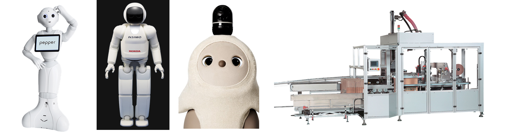
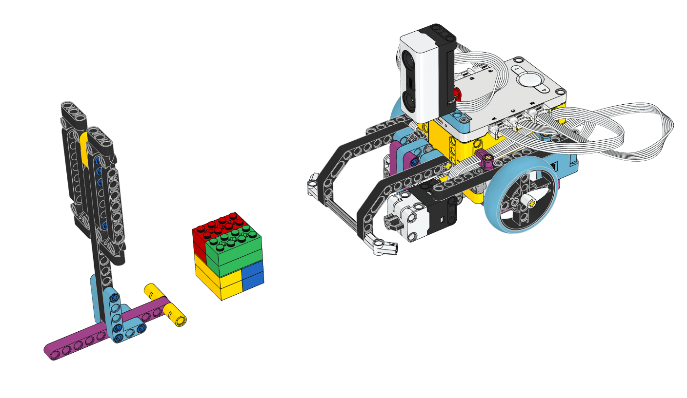
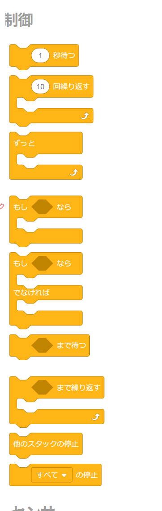
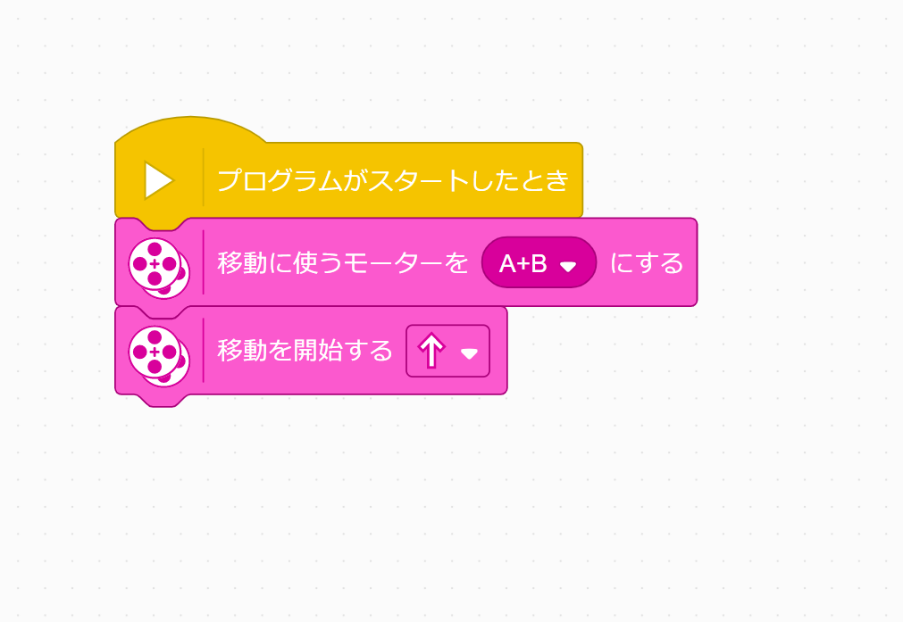
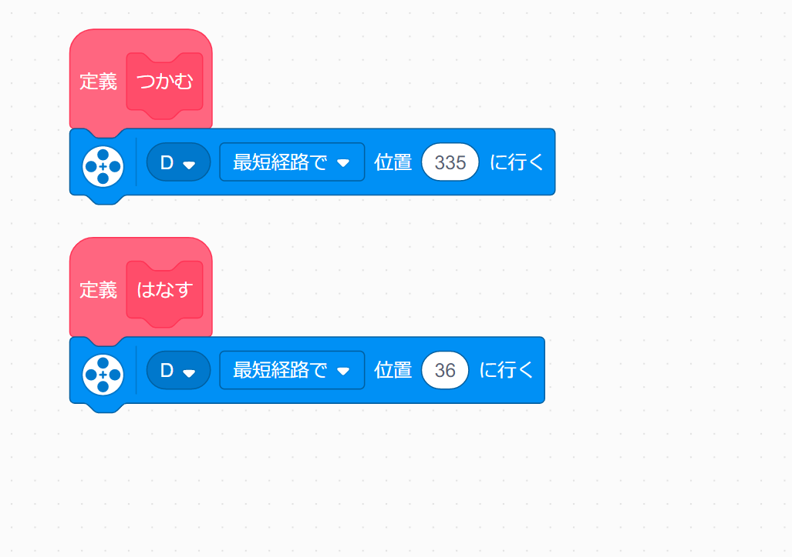
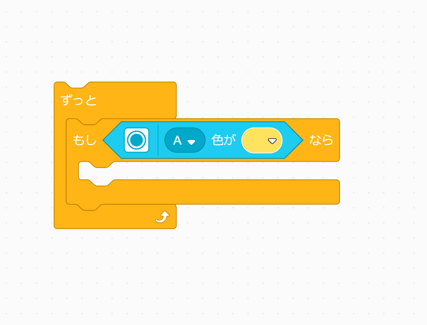
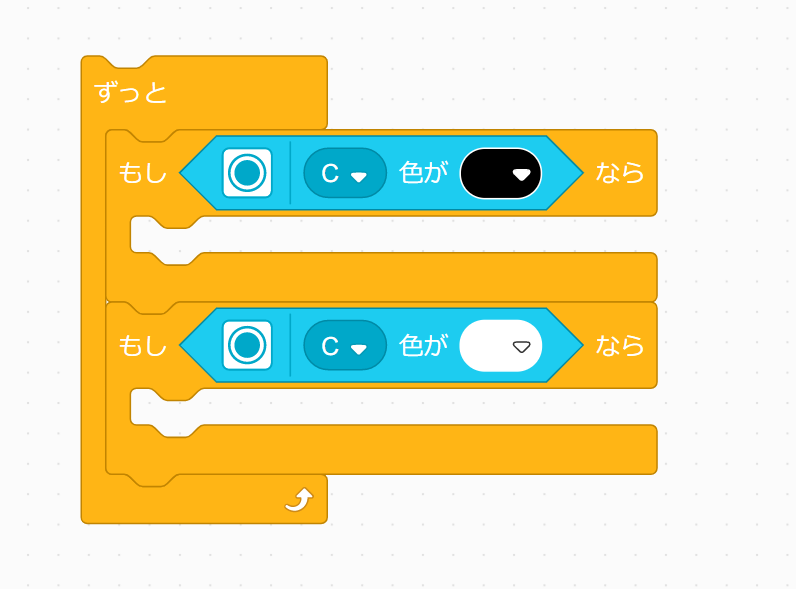

# AIC中学生向け講座「LEGO SPIKEでミッションを達成しよう！(仮称)」テキスト

## 0. はじめに
### ロボットって，なに？

ロボットと聞いて，皆さんは何を思い浮かべますか？ PepperやASIMOのような人形ロボット，またはパロやLOVOT，aiboなどの人に癒しを与えるロボット，あるいは工場や倉庫などで働く大型の産業用ロボットを想像する人もいるかもしれません．大辞泉には，ロボットの定義について以下のようにあります．

> ロボット（robot）
> 1. 電気・磁気などを動力源とし、精巧な機械装置によって人間に似た動作をする人形。人造人間。
> 2. 目的の作業・操作をコンピューターの制御で自動的に行う機械や装置。人間の姿に似るものに限らない。自動機械。  
> ──デジタル大辞泉

今回は， フィールドに置かれた**ミッション(＝目的)** を，皆さんが組んだプログラムで**自動的に**達成する機械をグループで作成していただきます．

### タイムテーブル
| 時間 | 内容                                             |
| ---- | ------------------------------------------------ |
| ～10 | イントロダクション                               |
| ～30 | 機体を組み立てよう！                             |
| ～60 | Scratchで簡単に動かしてみよう！                  |
| ～90 | ミッションを達成できるプログラムを考えてみよう！ |
| 15分 | 休憩                                             |
| ～40 | 続き                                             |
| ～60 | 競技                                             |
| ～85 | 結果発表・講評                                   |
| ～90 | おわりに                                         |

## 1. 機体を組み立てよう
LEGO SPIKEというLEGO社が発売している教育向けロボットキットを使います．

[テキスト1](https://education.lego.com/v3/assets/blt293eea581807678a/blte58422fa7d508a60/5f8802b882eaa522ca601c9f/driving-base-bi-pdf-book1of1.pdf), [テキスト2](https://education.lego.com/v3/assets/blt293eea581807678a/blt4bbe3f59ee1a3097/5f88024bde194e1bde3f0844/driving-base-tools-accessories-bi-pdf-book1of1.pdf)を参考に機体を組み立てましょう．

## 2. Scratchで簡単に動かしてみよう
### 2-1. Scratchって何？
Scratchは教育向けに開発されたビジュアルプログラミング言語です．ブロックをマウスで繋げていくことで，直感的にプログラムを作ることができます．今回はScratchを使って，LEGO SPIKEのロボットを動かします．

### 2-2. はじめの一歩
- 制御ブロック
  

Scratchでプログラムを組む上で重要となるのが，「制御」ブロックです．これらのブロックを組み合わせることで，プログラムの **流れを変える** ことができます．詳しくはロボットを動かしながら身につけていきましょう！

- ロボットを前に動かす
移動に使うモータを決めてからどの向きに移動するかを決めます．ロボットが前に動いたら成功です！
  

- アームを動かす
位置指定ブロックを使うと，モータを指定した角度に回すことができます．また，マイブロックを定義することで，処理のまとまりにわかりやすい名前をつけることができます．ここでは，アームでつかむ動きとはなす動きをマイブロックにしてみました．
  

- センサーを見る
よく使うのは以下の形です．
  

このようにすると，「ずっと」のループの中で常にセンサの情報を読んで，条件を満たしたときに「もし」の中に入るという動作になります．

### 2-3. 小課題
上を参考に，センサの色が黄色ならばロボットが止まる，というプログラムを組んでみましょう．

## 3. ミッションを達成できるプログラムを考えてみよう！
### 3-1. 線をトレースしよう
以下のプログラムを作ってみましょう．  
  

それぞれの「もし」ブロックの中をどうすれば線をトレースして走れるか，考えてみよう．

### 3-2. 障害物をよけるマイブロックを作ろう
実際に試しながら，障害物をよける動作を作ろう！

#### 画像引用元
https://robotstart.info/robot-database/pepper  
https://www.honda.co.jp/ASIMO/about/#newtype  
https://www.youtube.com/channel/UCptHYKMWRCrj2bWr74qhb5w  
https://www.kyotoss.co.jp/product/  